# 정서샤워 모바일 앱 MVP 개발 용역 결과보고서

---

## 1. 과업 개요

### 가. 개발배경 및 목적

'타인 돕기' 활동 및 정서 기록을 통한 과학적 효과 검증 및 데이터 수집을 핵심 목표로 하는 6주 프로그램 운영을 위한 최소 기능 제품(MVP) 구현

### 나. 용역기간

2025.10.29. - 2025.11.25.

### 다. 용역금액

5,500,000원(부가세 별도)

---

## 2. 구체적인 개발 업무 및 개발 범위(내용)

본 과업은 '정서샤워' 프로그램 운영 및 핵심 데이터 수집을 목적으로 하는 모바일 웹 기반 MVP 개발을 주요 내용으로 하며, 과업지시서에 명시된 모든 기능을 구현 완료하였음.

### 2.1 회원가입 및 사용자 프로필 설정 기능

#### 구현 내용
- **이메일 기반 회원가입**: Supabase Auth를 활용한 이메일/비밀번호 인증 시스템 구현
- **필수 정보 수집**: 이메일(ID), 이름, 비밀번호 수집
- **개인정보 동의**: 회원가입 시 개인정보 수집 및 이용 동의 체크박스 구현
- **온보딩 컨텐츠**: 6단계 온보딩 플로우를 통한 서비스 목적 및 사용 방법 안내
  - Step 1: 서비스 철학 소개
  - Step 2: 개인 목표 설정
  - Step 3: 대화 톤 선택
  - Step 4: 감정 인식 연습
  - Step 5: 대화 방식 선택 (음성/텍스트)
  - Step 6: 완료 및 시작

#### 구현 화면

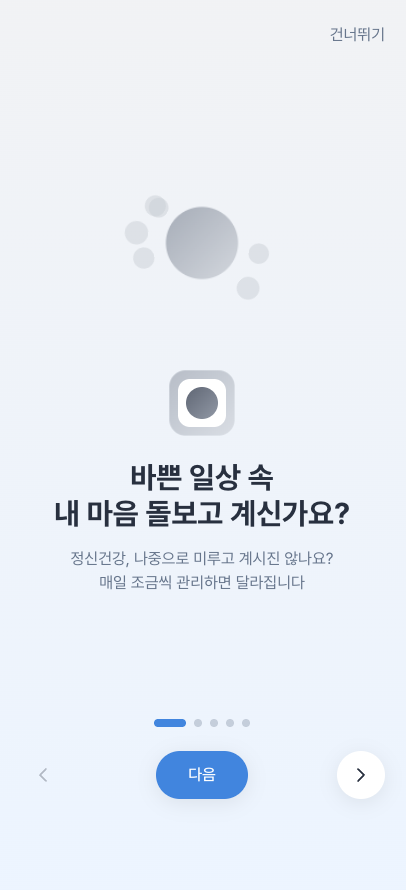
*인트로 화면 - 서비스 소개 및 시작하기*

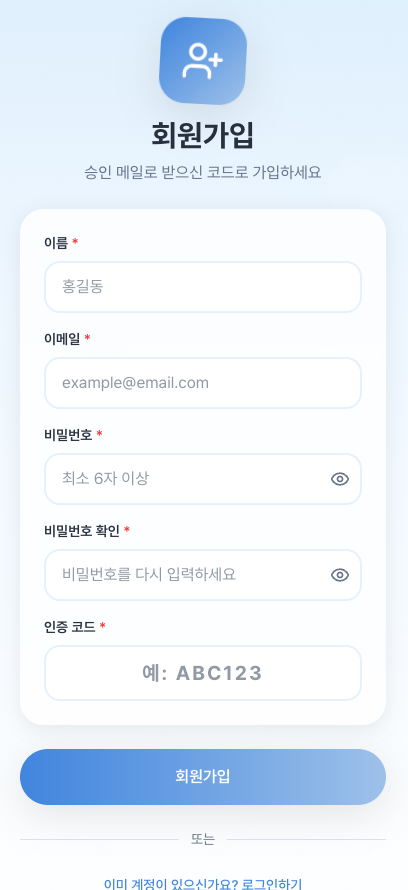
*회원가입 화면 - 이메일, 이름, 비밀번호 입력 및 개인정보 동의*

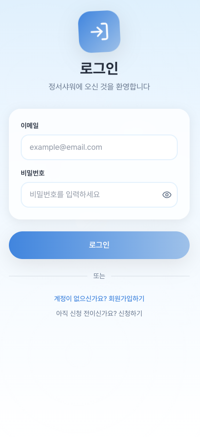
*로그인 화면 - 이메일/비밀번호 입력*

---

### 2.2 정서 및 행동 로깅 기능 (핵심 데이터 수집)

#### 구현 내용
- **30일 친절 챌린지 기반 일일 기록 시스템**
  - 매일 자기돌봄 행동과 타인친절 행동을 구분하여 기록
  - 각 행동에 대한 상세 메모 추가 기능
  - 일일 완료 시 격려 명언 카드 표시

- **자기돌봄 행동 기록 (Self-care Actions)**
  - 기본 예시 제공: 운동, 명상, 독서, 충분한 수면 등
  - 사용자 커스텀 행동 추가 가능
  - 각 행동별 메모 기능

- **타인친절 행동 기록 (Kindness Actions)**
  - 기본 예시 제공: 인사하기, 감사 표현, 도움 주기, 칭찬하기 등
  - 사용자 커스텀 행동 추가 가능
  - 각 행동별 메모 기능

- **데이터 저장 구조**
  - Supabase PostgreSQL 데이터베이스 사용
  - JSONB 형식으로 유연한 행동 데이터 저장
  - daily_records 테이블에 일자별 기록 저장

#### 구현 화면

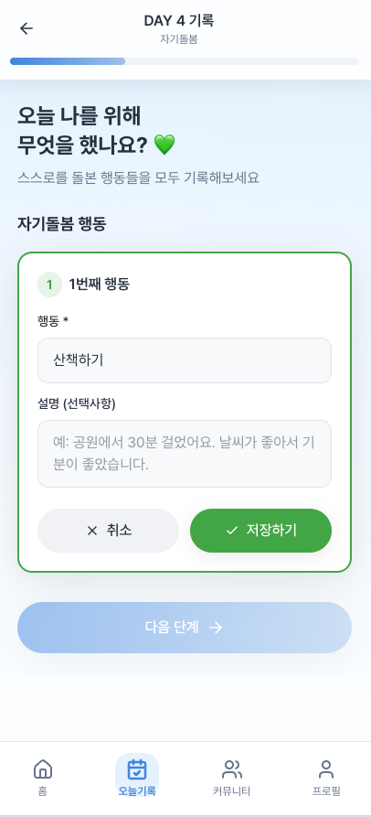
*일일기록 화면 Step 1 - 자기돌봄 행동 기록*

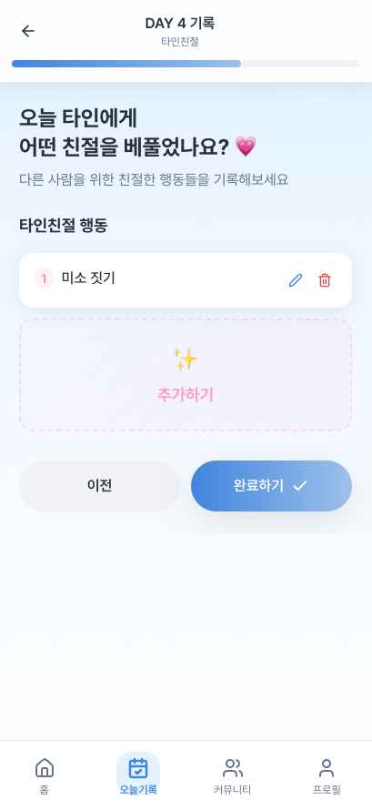
*일일기록 화면 Step 2 - 타인친절 행동 기록*

---

### 2.3 개인별 동기 부여 및 게임화 기능

#### 구현 내용
- **30일 스탬프 보드 (도장판)**
  - 6x5 그리드 형태의 시각적 진행 표시
  - 완료된 날은 스탬프(도장)로 표시
  - 현재 진행 중인 날 하이라이트
  - 남은 날짜 시각적 표시

- **진행률 표시 바 (Progress Bar)**
  - 전체 30일 중 완료 일수 표시
  - 22일 목표 달성 시 리포트 접근 가능 표시

- **코호트 기반 통계 대시보드**
  - 오늘의 완료율 (%) 실시간 표시
  - 연속 기록 달성자 수 표시
  - 평균 스탬프 수 표시
  - TOP 5 랭킹 표시

- **성취 메시지 및 격려**
  - 일일 기록 완료 시 축하 메시지
  - 연속 기록 달성 시 특별 메시지
  - 코호트 완료율 70% 이상 시 단체 격려 메시지

#### 구현 화면

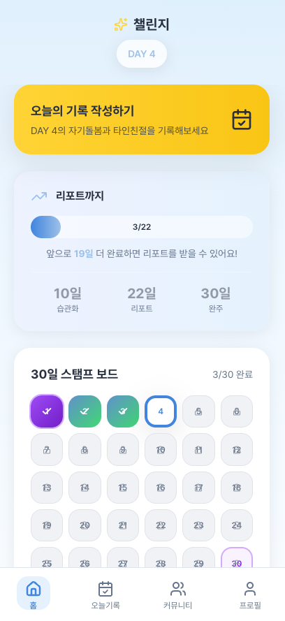
*홈 화면 - 30일 스탬프보드 및 진행률 표시*

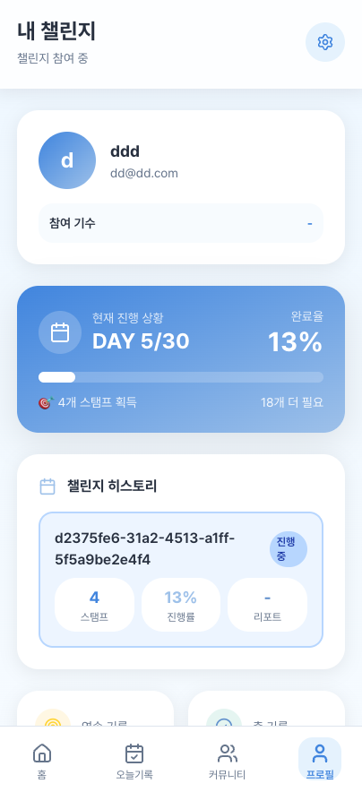
*프로필 화면 - 개인 통계 및 즐겨찾는 행동*

---

### 2.4 설문 및 평가 기능 (과학적 검증 및 데이터 저장)

#### 구현 내용
- **사전/사후 설문 시스템**
  - 챌린지 시작 전 사전검사 (Pre-Survey)
  - 30일 완료 후 사후검사 (Post-Survey)
  - 동일한 34문항으로 변화 측정

- **4가지 심리 평가 척도 구현**

  | 척도명 | 문항 수 | 측정 내용 |
  |--------|---------|-----------|
  | 번영척도 (Flourishing Scale) | 8문항 | 목적의식, 관계, 참여, 기여, 역량, 자존감, 낙관성, 존중 |
  | 삶의 만족도 척도 (SWLS) | 5문항 | 삶의 일치도, 조건, 만족도, 목표 달성, 삶의 선호 |
  | 자기자비척도 (SCS-SF) | 12문항 | 자기친절, 공통인간성, 마음챙김 (역채점 포함) |
  | 친절행동척도 | 9문항 | 도움, 기부, 안내, 양보, 문 잡기, 헌혈, 봉사활동 빈도 |

- **5점 리커트 척도**
  - "전혀 아니다" (1점) ~ "매우 그렇다" (5점)
  - 역채점 문항 자동 처리

- **결과 데이터 저장**
  - surveys 테이블에 응답 및 점수 저장
  - JSONB 형식으로 유연한 데이터 구조
  - 사전/사후 비교 분석 가능

- **분석 리포트 제공**
  - 22일 이상 완료 시 리포트 접근 가능
  - 척도별 사전/사후 점수 비교
  - 개선율 (%) 시각적 표시
  - 즐겨찾는 자기돌봄/타인친절 행동 TOP 5

#### 구현 화면

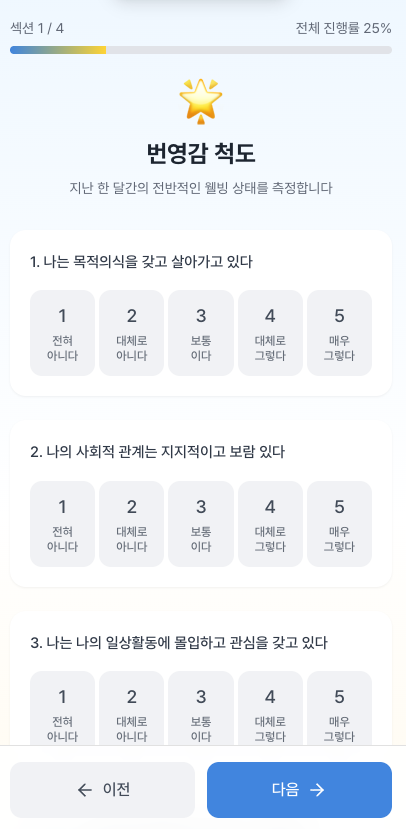
*사전설문 화면 - 34문항 설문 진행*

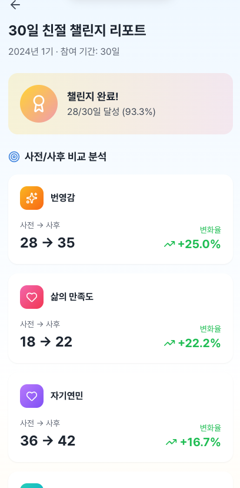
*분석 리포트 화면 - 사전/사후 비교 및 개선율 표시*

---

### 2.5 커뮤니티 기능 (단계적 도입 및 소셜 행동)

#### 구현 내용
- **코호트 기반 커뮤니티 피드**
  - 같은 기수(코호트) 참여자들끼리만 게시글 공유
  - 통합 피드 형태로 모든 게시글 표시
  - Row-Level Security (RLS)를 통한 자동 필터링

- **익명 게시글 작성**
  - 자동 생성 익명 닉네임 (예: "따뜻한마음123")
  - 랜덤 이모지 아바타 자동 부여
  - 공개 희망 활동 내역 공유

- **상호작용 기능**
  - 좋아요 버튼 (게시글/댓글)
  - 댓글 기능
  - AI 추천 명언 시스템 댓글 (자동 생성)

- **코호트 통계 대시보드**
  - 오늘의 완료율 실시간 표시
  - 연속 기록 달성자 수
  - 평균 스탬프 수
  - TOP 5 랭킹

#### 구현 화면

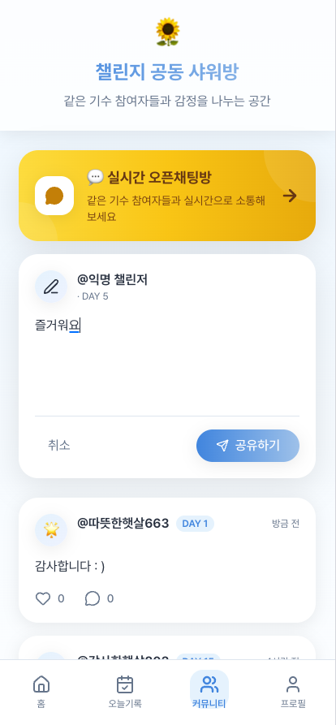
*커뮤니티 메인 화면 - 코호트 피드 및 통계*

---

### 2.6 관리자 기능 (추가 구현)

과업지시서에 명시되지 않았으나, 프로그램 운영 효율성을 위해 종합 관리자 시스템을 추가 구현하였음.

#### 구현 내용
- **관리자 인증 시스템**
  - Supabase Auth 기반 관리자 로그인
  - users 테이블 is_admin 플래그로 권한 관리
  - 관리자 전용 라우팅 및 접근 제어

- **대시보드**
  - 전체 사용자 수, 활성 챌린지 수, 게시글/댓글 수 KPI
  - 코호트별 완료율 차트
  - 일별 가입자 추이 그래프

- **사용자 관리**
  - 전체 사용자 목록 조회
  - 검색, 정렬, 필터 기능
  - 사용자별 상세 정보 및 챌린지 현황

- **코호트 관리**
  - 코호트 생성/수정/조회
  - 시작일, 종료일, 정원 설정
  - 기록 유형 설정 (자기돌봄만/타인친절만/둘 다)
  - 상태 관리 (모집중/진행중/완료)

- **신청서 관리**
  - 대기 중인 신청서 목록
  - 6자리 승인 코드 자동 발급
  - 코호트 배정 기능

- **설문 응답 관리**
  - 사용자별 사전/사후 설문 응답 조회
  - 척도별 점수 확인
  - 전체 응답 데이터 접근

- **일일 기록 관리**
  - 사용자별, 일자별 기록 조회
  - 자기돌봄/타인친절 행동 상세 확인
  - 메모 내용 확인

- **커뮤니티 관리**
  - 전체 게시글/댓글 조회
  - 부적절한 콘텐츠 관리

- **통계 분석**
  - 코호트별 성과 분석
  - 참여율, 완료율 통계
  - 설문 결과 집계

#### 구현 화면

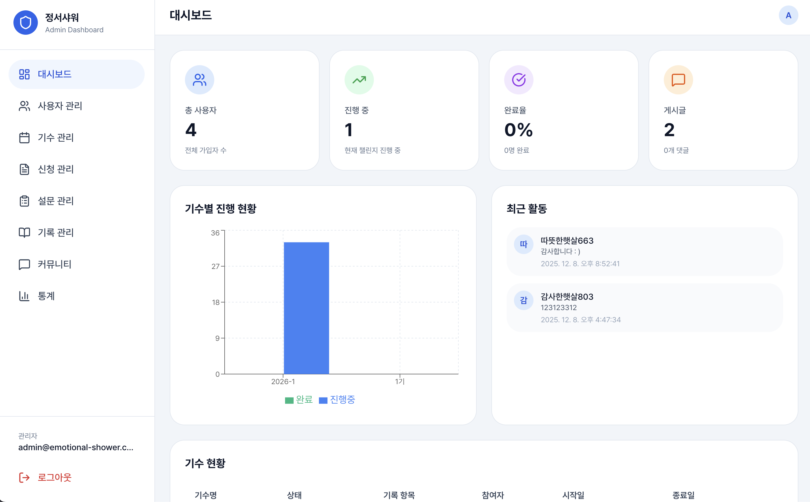
*관리자 대시보드 - KPI 및 차트*

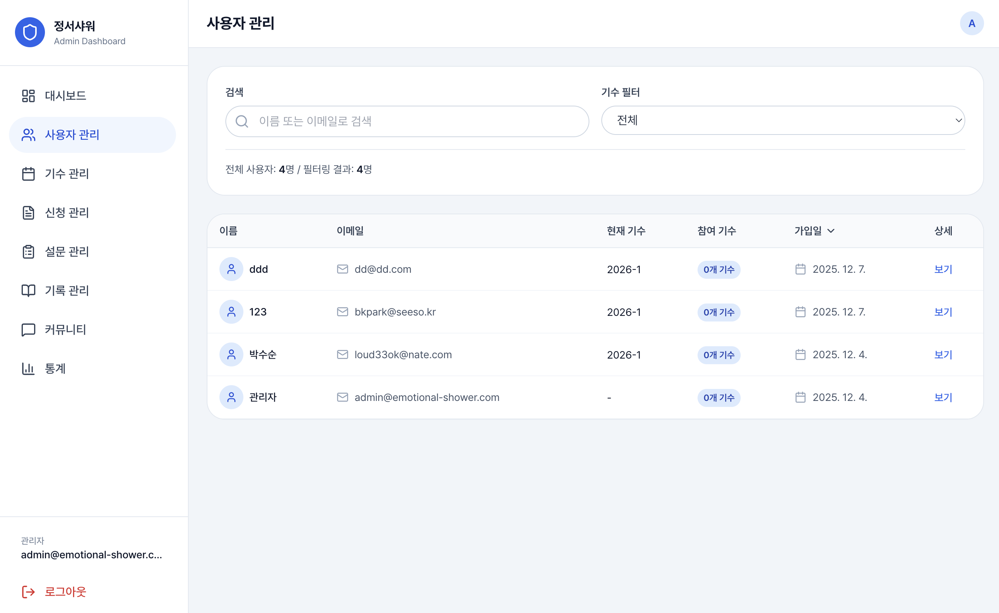
*사용자 관리 화면 - 목록 및 상세*

---

## 3. 과업별 추진 경과

### 3.1 추진 일정 요약

| 단계 | 기간 | 주요 내용 | 완료 현황 |
|------|------|----------|----------|
| **1단계: 착수 및 설계** | 1주차 (10.29~11.04) | 개발환경 구축, UI/UX 설계, DB 설계 | 완료 |
| **2단계: 핵심 기능 개발** | 2주차 (11.05~11.11) | 회원가입, 정서/행동 로깅, 게임화 기능 | 완료 |
| **3단계: 부가 기능 및 통합** | 3주차 (11.12~11.18) | 설문/평가 기능, 커뮤니티 기능 | 완료 |
| **4단계: 테스트 및 완료** | 4주차 (11.19~11.25) | QA 테스트, 배포, 산출물 제출 | 완료 |

### 3.2 단계별 상세 추진 내용

#### 1단계: 착수 및 설계 (1주차)
- 착수 보고 및 요구사항 확정
- 개발 환경 구축
  - React 19 + TypeScript + Vite 프로젝트 초기화
  - Supabase 프로젝트 생성 및 연동
  - Tailwind CSS + shadcn/ui 디자인 시스템 구축
- 핵심 기능 정의 및 User Journey 확정
- 데이터베이스 스키마 설계
  - 9개 핵심 테이블 정의
  - Row-Level Security 정책 설계
- UI/UX 디자인 완료
  - Cloud-Based 테마 디자인 시스템
  - 모바일 퍼스트 반응형 레이아웃

#### 2단계: 핵심 기능 개발 (2주차)
- 회원가입 및 정보 설정 기능 구현
  - Supabase Auth 연동
  - 이메일 인증 플로우
  - 6단계 온보딩 플로우
- 정서 및 행동 로깅 기능 구현
  - 일일 기록 3단계 플로우
  - 자기돌봄/타인친절 행동 분리 기록
  - JSONB 기반 유연한 데이터 저장
- 개인별 동기 부여 및 게임화 기능 구현
  - 30일 스탬프보드
  - 진행률 표시 바
  - 코호트 통계 대시보드

#### 3단계: 부가 기능 및 통합 (3주차)
- 설문 및 평가 기능 구현
  - 4개 심리 척도 34문항 구현
  - 사전/사후 설문 시스템
  - 분석 리포트 자동 생성
- 커뮤니티 기능 구현
  - 익명 게시글/댓글 시스템
  - 좋아요 기능 (Atomic 업데이트)
  - AI 추천 명언 시스템
- 관리자 기능 구현
  - 관리자 인증 시스템
  - 8개 관리 페이지 개발

#### 4단계: 테스트 및 완료 (4주차)
- 기능 테스트 (QA)
  - 회원가입/로그인 플로우 테스트
  - 일일 기록 및 설문 플로우 테스트
  - 커뮤니티 기능 테스트
  - 관리자 기능 테스트
- 통합 테스트
  - 전체 User Journey 통합 테스트
  - 크로스 브라우저 테스트
  - 모바일 반응형 테스트
- 배포 및 산출물 제출
  - Vercel 프로덕션 배포
  - 소스코드 및 문서 정리

---

## 4. 기타 사항

### 4.1 기술 스택

| 구분 | 기술 | 버전 |
|------|------|------|
| **Frontend Framework** | React | 19.1.1 |
| **Language** | TypeScript | 5.8.3 |
| **Build Tool** | Vite | 7.1.2 |
| **Backend/DB** | Supabase (PostgreSQL) | - |
| **Authentication** | Supabase Auth | 2.86.0 |
| **Styling** | Tailwind CSS | 3.4.17 |
| **UI Components** | shadcn/ui (Radix UI) | - |
| **State Management** | Zustand | 5.0.8 |
| **Animation** | Framer Motion | 12.23.12 |
| **Routing** | React Router DOM | 7.8.2 |
| **Charts** | Recharts | 3.1.2 |
| **Deployment** | Vercel | - |

### 4.2 최종 결과물

#### 4.2.1 개발 소스코드 전체
- GitHub 저장소: 전체 프론트엔드 및 백엔드(Supabase) 소스코드
- 구조:
  ```
  emotional-shower/
  ├── src/
  │   ├── components/     # UI 컴포넌트 (50+ 파일)
  │   ├── pages/          # 페이지 컴포넌트 (20+ 파일)
  │   ├── store/          # Zustand 상태 관리 (10개 스토어)
  │   ├── lib/            # 유틸리티 및 Supabase 클라이언트
  │   └── App.tsx         # 라우팅 설정
  ├── supabase/
  │   └── migrations/     # DB 마이그레이션 (9개 파일)
  └── docs/               # 문서 및 스크린샷
  ```

#### 4.2.2 데이터베이스 스키마 및 설계서
- 9개 마이그레이션 파일로 정의된 DB 스키마
- 핵심 테이블:
  | 테이블명 | 설명 |
  |----------|------|
  | users | 사용자 프로필 |
  | cohorts | 코호트 정보 |
  | user_cohorts | 사용자-코호트 참여 관계 |
  | challenges | 챌린지 진행 상태 |
  | daily_records | 일일 기록 데이터 |
  | surveys | 설문 응답 데이터 |
  | applications | 참가 신청서 |
  | application_codes | 승인 코드 |
  | community_posts | 커뮤니티 게시글 |
  | community_comments | 댓글 |

### 4.3 과업 대비 추가 구현 사항

과업지시서 요구사항 외에 프로그램 운영 효율성 및 데이터 관리를 위해 다음 기능을 추가 구현하였음:

1. **종합 관리자 시스템**
   - 8개 관리 페이지 (대시보드, 사용자, 코호트, 신청서, 설문, 기록, 커뮤니티, 통계)
   - 관리자 인증 및 권한 관리

2. **Row-Level Security (RLS) 보안 정책**
   - 모든 테이블에 사용자별 접근 제어 적용
   - 관리자 전용 접근 정책 구현

3. **코호트 기반 참여자 관리 시스템**
   - 다중 코호트 운영 지원
   - 코호트별 기록 유형 커스터마이징

4. **사전/사후 설문 비교 분석 리포트**
   - 척도별 점수 비교
   - 개선율 자동 계산 및 시각화

5. **반응형 모바일/데스크톱 UI**
   - 모바일 퍼스트 디자인
   - 데스크톱 헤더 및 레이아웃 최적화

### 4.4 운영 가이드

#### 프로그램 운영 플로우
1. 관리자가 코호트 생성 (시작일, 종료일, 정원 설정)
2. 참가 희망자 신청서 제출 (Apply 페이지)
3. 관리자가 신청서 검토 및 승인 코드 발급
4. 참가자가 승인 코드로 회원가입
5. 온보딩 완료 후 사전설문 진행
6. 30일 일일 기록 진행
7. 30일 완료 후 사후설문 진행
8. 22일 이상 완료 시 리포트 열람 가능

#### 관리자 계정 설정
- Supabase Dashboard에서 users 테이블의 is_admin 값을 true로 설정

---

## 부록: 스크린샷 목록

| 번호 | 화면명 | 파일명 | 설명 |
|------|--------|--------|------|
| 1 | 인트로 | intro.png | 서비스 소개 캐러셀 |
| 2 | 회원가입 | signup.png | 이메일 회원가입 폼 |
| 3 | 로그인 | login.png | 로그인 화면 |
| 4 | 홈 | home-stampboard.png | 스탬프보드 및 진행률 |
| 5 | 일일기록 Step1 | daily-record-step1.png | 자기돌봄 행동 기록 |
| 6 | 일일기록 Step2 | daily-record-step2.png | 타인친절 행동 기록 |
| 7 | 사전설문 | pre-survey.png | 34문항 설문 |
| 8 | 리포트 | report.png | 사전/사후 비교 리포트 |
| 9 | 커뮤니티 | community-main.png | 코호트 피드 |
| 10 | 프로필 | profile-stats.png | 개인 통계 |
| 11 | 관리자 대시보드 | admin-dashboard.png | 관리자 KPI |
| 12 | 사용자 관리 | admin-users.png | 사용자 목록 |

---

*본 결과보고서는 2025년 11월 25일 기준으로 작성되었습니다.*
